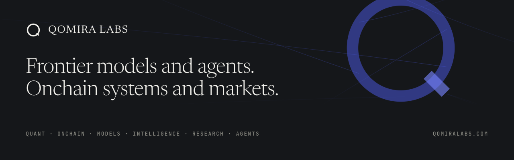

  

  <a href="https://qomiralabs.com">qomiralabs.com</a> ·
  <a href="https://huggingface.co/qomiralabs">Hugging Face</a> ·
  <a href="https://x.com/qomiralabs">X</a> ·
  <a href="https://www.linkedin.com/company/qomiralabs">LinkedIn</a>

---

Qomira Labs is a research company with two programmes that stand on their own. Models for video, audio, image, and text, and agents. Onchain protocols, markets, blockchain infrastructure, and quantitative research.

We do the core work once, and our products take it to the people who use it.

## What the name means

Six letters, six lines of work, one company. Pronounced koh-MEE-ra.

| | | |
|---|---|---|
| **Q** | Quant | Systematic research into markets, pricing, and risk. |
| **O** | Onchain | Protocols, liquidity, settlement, and blockchain infrastructure. |
| **M** | Models | Frontier models for video, audio, image, and text. |
| **I** | Intelligence | Reasoning, evaluation, and the science of what these systems do. |
| **R** | Research | The work we publish. |
| **A** | Agents | Systems that plan, use tools, and act. |

## What we work on

**Models and agents.** Video, audio, image, and text. Agents that plan, use tools, and act under real constraints.

**Onchain and markets.** Protocols, liquidity, settlement, and blockchain infrastructure. Systematic research into markets, pricing, and risk.

**Foundations.** The training and serving systems everything else runs on. Data collection, curation, and evaluation sets. Confidential deployment, supply chain, and the integrity of systems that hold value.

**Physical AI.** Spatial models small enough to run on the machine. The environments these systems will be deployed into and that nobody has captured. Whether a policy survives dust, heat and ground that is not level, and the control layer that decides whether it can be deployed at all.

**Safety, privacy and governance.** Whether a model refuses, in the language it is asked. What it remembers about the people in its data. Release norms, independent audit, and whose rules apply where.

## Products

The hard part of this work is expensive, and it does not get cheaper by being done repeatedly. So we do it in one place, and each product built on top of it goes deep on a single problem and ships.

**[Juncta](https://juncta.xyz).** The internet capital market for on-chain assets. Spot trading, lending, perpetuals, options, launchpad, and native RWA tokenization on one liquidity architecture, so no capital is trapped in a silo.

**[CelerFi](https://celerfi.network).** Many chains. One integration. Node access, enriched on-chain data, real-time event streaming, payments, security, and yield infrastructure through one API key, one dashboard, and one bill.

**[SPP](https://spp-protocol.org).** A verifiable meter for machine services. An open protocol that ties a payment to evidence of the work it paid for, so the buyer can check the bill and the money comes back when the evidence fails.

All three are in development. None is live yet.

## Here

Weights and model cards go to [Hugging Face](https://huggingface.co/qomiralabs). Code, tooling, and evaluation harnesses go here. We publish when the work is ready, so this account will look quiet between releases. That is the intended state, not neglect.

What will land: benchmarks and the evaluation sets behind them, model and dataset releases with the weights, measurements of what things actually cost to run, and the results our own systems fail. Negative results included, because a lab that publishes only its successes teaches everyone to hide.

Two rules we hold ourselves to. The runnable artifact is the release and the paper is its documentation, so nothing is announced that is not runnable the same day. And every model release carries its cost: parameters, quantised footprint, throughput on a named device, and measured latency.

## Contact

Research correspondence: [research@qomiralabs.com](mailto:research@qomiralabs.com)
Anything else: [hello@qomiralabs.com](mailto:hello@qomiralabs.com)
Press, partnerships, and brand assets: [brand@qomiralabs.com](mailto:brand@qomiralabs.com)
